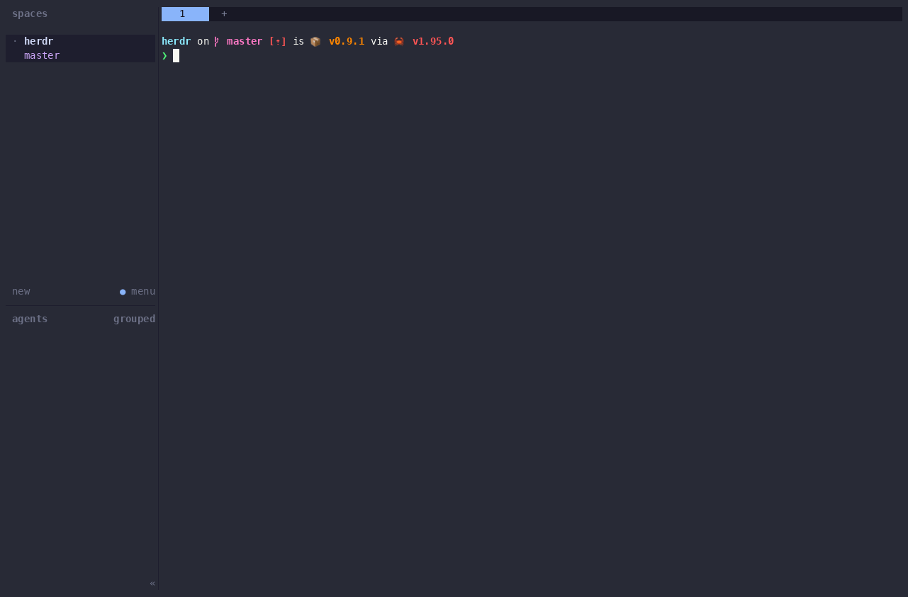

<div align="center">

# herdr-orchestrator

*Odysseus · governed multi-agent workflows, native to Herdr*

<a href="https://github.com/jpolec/herdr-plugin-odysseus/releases"></a>
<a href="https://github.com/jpolec/herdr-plugin-odysseus/actions/workflows/ci.yml"></a>
<a href="https://herdr.dev"></a>


<a href="LICENSE"></a>

**Hand a task to your coding agents, and get back a tested, reviewed, policy-checked draft PR — while every agent stays in a real Herdr pane you can watch and take over.**

</div>

---

## What it is

A [Herdr](https://herdr.dev) plugin that adds a governed workflow layer on top of
the agents you already run in Herdr:

```text
task → isolated worktree → agent → tests (retry with feedback) → independent review
     → policy check → your approval → draft PR → tamper-evident audit record
```

You type *"Add rate limiting to the webhooks endpoint"*. The orchestrator creates a
fresh git worktree and branch, starts Codex (or Claude, OpenCode, …) in a new Herdr
pane, runs your tests, feeds failures back to the same agent, asks Claude to review
the diff, checks every changed file against your policy, and stops for your
approval before it pushes anything.

## See it run

Three short recordings from a fresh Herdr session on a clone of the Herdr repo.
The agents are the built-in fakes, so nothing here needs an account; with
Claude or Codex the flow is the same, just slower. Each GIF has an
[MP4](assets/demo) next to it.

**1. Queue a task from the popup.** `prefix+shift+o` opens the orchestrator.
`n` opens the form: describe the task, pick a workflow and runner, `ctrl+s`.
The run gets its own worktree (it appears in the sidebar), `enter` shows the
steps as they run, and `d` shows the diff it produced.


**2. A policy gate.** The task is created from the shell this time. The agent
adds a database migration, which the default policy never lets through
silently: the run stops and waits. `a` lists what is waiting for you; the
approval shows why it stopped, the diff and the rule that matched. `y`
approves this one action, and the run finishes.



**3. A full workflow.** `implement-review-demo`: the agent implements, the
tests fail, the failure goes back to the same agent, the second attempt
passes, a reviewer approves, and the run asks *"Ship it?"* before it counts
as done. You only step in at the end.


## Why

Running several agents in Herdr is easy. Keeping them *honest* is not: each one
works in your checkout, you re-run the tests yourself, you paste failures back by
hand, you remember which pane was doing what, and nothing stops an agent from
touching `.env`, a migration or your CI config without you noticing.

herdr-orchestrator does the loop for you and puts the risky moments in front of
you — without hiding the agents. It never runs them headless behind your back:
they are ordinary Herdr panes (`#124 implement · codex`) you can read, type into,
or close.

## Herdr alone vs. with herdr-orchestrator

Herdr is deliberately lean: it is the best place to *run* agents, and it leaves
workflow to plugins. This plugin builds on what Herdr does well and fills in the
rest.


Without the plugin you can do all of this by hand — `herdr worktree create`,
`herdr agent start`, `herdr agent prompt --wait`, run the tests yourself, paste
failures back, start a reviewer, check the diff, open the PR. The plugin runs that
loop for you and enforces your rules along the way.

## What you get

- **One task, one worktree, one branch.** Parallel runs never share a checkout.
  Nothing is force-pushed, reset or deleted while it has uncommitted work.
- **Tests with retries that learn.** A failing check sends a trimmed failure log
  back to the *same live agent*, which keeps its context. Retries are bounded.
- **A second opinion.** A different agent reviews the diff and returns structured
  findings; with `gate: true` the findings go back to the implementer to fix.
- **Your rules, enforced.** A conservative default policy denies secrets,
  force pushes, `reset --hard`, `terraform destroy`…, and asks you before
  migrations, infrastructure, CI changes, pushes and PRs. Checked before the
  orchestrator runs anything *and* on the diff of whatever the agents wrote.
- **Approvals with context.** Changed files, diff stats, checks, the policy rule
  that fired and exactly what will happen when you say yes.
- **Tournament mode.** Run a task ×3 (`codex, codex, claude`), compare the diffs,
  tests and reviews side by side, and pick one yourself — no opaque "best" score.
- **An audit trail you can verify.** Every decision in hash-chained JSONL,
  secrets redacted: `herdr-orchestrator audit verify`.
- **Survives restarts.** Close the pane, the client, even the engine: runs pick
  up where they were, and nothing ambiguous is re-run blindly.
- **Local only.** No account, no SaaS, no telemetry. It uses your logged-in
  `claude`, `codex`, `gh`.

## Quick start

**1. Install**

```sh
herdr plugin install jpolec/herdr-plugin-odysseus
```

Herdr shows what the plugin will run, then builds it with Cargo (about a minute,
without progress output — let it finish).

**2. Add a key** to `~/.config/herdr/config.toml`, then `herdr server reload-config`
(press `ctrl+b`, release, then `shift+o`):

```toml
[[keys.command]]
key = "prefix+shift+o"
type = "plugin_action"
command = "jpolec.herdr-orchestrator.open"
description = "orchestrator"
```

(`prefix+o` is already Herdr's *open notification target*, so the plugin does not
take it. `shift` rather than `alt`: on macOS the Option key often reaches Herdr as
`Esc` + `o`, especially inside tmux. The plugin never edits your config.)

**3. Open a repository workspace in Herdr, press `prefix+shift+o`, then `n`**, type
the task, pick a workflow and runner, `ctrl+s`. The orchestrator opens as a popup
(like lazygit); `q` closes it and your runs keep going. The agent appears as a new
tab in a workspace for its worktree — `f` on a run jumps straight to it.

> [!IMPORTANT]
> **No restart needed.** The engine starts on demand when you create a task; it is
> not tied to Herdr's startup. Your existing panes and agents are never touched.

> [!NOTE]
> **Claude asks "Do you trust this folder?"** the first time it starts in a new
> worktree. The run shows `awaiting human` and waits — answer it in the agent's
> pane (`f` on the dashboard jumps there). Trusting your repository folder in
> Claude beforehand avoids it, since worktrees live inside the repository.

### Try it without spending a token

Every workflow runs with deterministic fake agents. Pick `fake-success` as the
runner in the form, or from a shell:

```sh
herdr plugin action invoke jpolec.herdr-orchestrator.install-cli   # optional: puts herdr-orchestrator in ~/.local/bin
cd your-repo
herdr-orchestrator task create "Add a --json flag" --workflow quick-task --runner fake-success
herdr-orchestrator run list
```

Fake agents finish instantly. To watch them in the dashboard, start the engine
with `HERDR_ORCH_FAKE_DELAY_MS=3000` so each one takes a few seconds.

### Or hand it to an agent

```text
Install the herdr-orchestrator plugin for Herdr on this machine.

1. herdr plugin install jpolec/herdr-plugin-odysseus   (answer y; it builds with cargo, ~1 minute)
2. herdr plugin action invoke jpolec.herdr-orchestrator.install-cli
3. herdr-orchestrator doctor   — every line should be OK or WARN, none ERROR.

Do NOT run `herdr server stop` and do not kill Herdr: that ends every program in
every pane. Nothing here needs a restart. Do not edit ~/.config/herdr/config.toml
without asking me.
```

## Workflows

| Workflow | What happens |
| --- | --- |
| `quick-task` | one agent in a worktree; diff checked and committed |
| `implement-review` | Codex implements → tests (2 retries with feedback) → Claude reviews → your approval → draft PR |
| `secure-change` | implement → tests → lint → security scan → gated security review → policy gate → approval → draft PR |
| `variant-review` | for `--variants N`: implement → tests → review in every variant; you compare and choose |

Workflows are short YAML files; add your own in `.ai/herdr-orchestrator/workflows/`.
See [WORKFLOWS](docs/WORKFLOWS.md) and the [example project](examples/).

## Questions

**Will it break my Herdr or my running agents?**
No. The plugin is a separate program: Herdr runs it when you invoke an action, once
at startup (to resume interrupted work, if any) and for a few milliseconds when a
pane closes or a worktree is removed (to wake its engine, if it is running). It
never touches panes it did not create, and a crash in it cannot crash Herdr.
When a run succeeds, its agent panes are closed (files and branch stay), so no
agent is left running with the task's instructions; failed runs keep theirs for
you to inspect. To switch it off: `herdr plugin disable jpolec.herdr-orchestrator`; to remove it:
`herdr plugin uninstall jpolec.herdr-orchestrator`.

**Is it a sandbox?**
No, and it does not pretend to be. Commands *the orchestrator* runs are checked
before they run. What an agent does inside its own pane is not intercepted in real
time; instead the agent starts with conservative permissions (Claude
`acceptEdits`, Codex `workspace-write` + `on-request`), works only in its
worktree, and the diff is checked against policy after every step — a forbidden
file blocks the run before anything is committed or pushed.
[SECURITY_MODEL](docs/SECURITY_MODEL.md) spells out what is and is not enforced.

**Does anything leave my machine?**
No telemetry, ever. Your agents, `git` and `gh` talk to their services as usual.

**What does it cost?**
Free and MIT licensed. Agent usage is billed by your providers as usual. Token and
cost figures are shown only when a provider reports them, and labelled
*reported*, *estimated* or *unknown* — never made up.

**Does it merge or deploy?**
Never. PRs are drafts, pushing and opening a PR need your approval by default,
and `github.auto_merge: true` is rejected.

**Where is my data?**
`~/.local/state/herdr/plugins/jpolec.herdr-orchestrator/` (runs, approvals, audit,
logs). `herdr-orchestrator config paths` prints every location.

## Reference

<details>
<summary><b>Orchestrator pane keys</b></summary>

| Screen | Keys |
| --- | --- |
| Dashboard | `n` new task · `enter` inspect · `a` approvals · `r` retry · `x` cancel · `d` diff · `f` focus agent pane · `p` pause queue · `q` quit |
| Run detail | `↑↓` step · `enter`/`l` log · `d` diff · `f` focus agent · `a` approval · `r` retry · `x` cancel · `esc` back |
| Approval | `y` approve once · `n` deny · `c` cancel run · `d` diff · `f` open agent pane · `esc` back |
| New task | `tab` next field · `←→` choose · `ctrl+s` create · `esc` cancel |

Herdr actions: `jpolec.herdr-orchestrator.open`, `.new-task` (popup form),
`.approvals`, `.install-cli`.
</details>

<details>
<summary><b>CLI</b></summary>

```bash
herdr-orchestrator plan "Add a --json flag"                      # dry run: what would happen, with policy
herdr-orchestrator task create "Add a --json flag" -w implement-review
herdr-orchestrator task create "Speed up ingestion" -w variant-review \
  --variants 3 --variant-runners codex,codex,claude
herdr-orchestrator task compare 2 && herdr-orchestrator task select 2 '#2B'
herdr-orchestrator run list | run show '#1' | run diff '#1' | run logs '#1'
herdr-orchestrator run retry '#1' [--from-step tests] | run cancel '#1' | run pr '#2B'
herdr-orchestrator approval list | approval show <id> | approval approve <id> --note "ok"
herdr-orchestrator policy check --command "git push -f origin main"   # DENY, exit 3
herdr-orchestrator audit verify --all
herdr-orchestrator doctor
herdr-orchestrator task create "smoke" --runner fake-success --foreground   # CI, no daemon
```

Also: `queue pause|resume|status`, `workflow list|show|validate`,
`policy validate|show`, `config show [--layers]|paths|init`, `runners`, `skills`,
`--json` everywhere.
</details>

<details>
<summary><b>Configuration</b></summary>

Precedence (later wins): built-in defaults → global
(`~/.config/herdr/plugins/config/jpolec.herdr-orchestrator/config.yaml`) →
project (`.ai/herdr-orchestrator/config.yaml`) → workflow defaults → task options
→ CLI flags. Project policy files are *added* to the global ones, never replace
them silently. `herdr-orchestrator config init` writes a commented project config;
[examples/](examples/) shows a complete project setup (checks, custom runner,
policy, workflow, skill).
</details>

<details>
<summary><b>Requirements</b></summary>

Herdr ≥ 0.9.0 on macOS or Linux · Rust stable (Herdr builds the plugin at install)
· `git` · optional: `gh` (PRs, issues), `claude`, `codex`, `opencode`.
</details>

<details>
<summary><b>Development</b></summary>

```bash
cargo test                       # unit + integration: real git, fake agents, mock Herdr; no accounts or network
cargo build --release && herdr plugin link .
```

Real end-to-end testing runs against an isolated *named* Herdr session, never your
default one: [HERDR_INTEGRATION](docs/HERDR_INTEGRATION.md#end-to-end-testing).
See [CONTRIBUTING](CONTRIBUTING.md).
</details>

## Documentation

[Architecture](docs/ARCHITECTURE.md) ·
[Herdr integration](docs/HERDR_INTEGRATION.md) ·
[Workflows](docs/WORKFLOWS.md) ·
[Policy engine](docs/POLICY_ENGINE.md) ·
[Runners](docs/RUNNERS.md) ·
[Audit](docs/AUDIT.md) ·
[Recovery](docs/RECOVERY.md) ·
[Security model](docs/SECURITY_MODEL.md) ·
[Threat model](docs/THREAT_MODEL.md) ·
[Upstream requests](docs/UPSTREAM_REQUESTS.md) ·
[Roadmap](docs/ROADMAP.md) ·
[Security policy](SECURITY.md) ·
[Changelog](CHANGELOG.md)

## Acknowledgements

[open-mercato/cezar](https://github.com/open-mercato/cezar) (MIT) was the functional
reference for tasks, queues, worktrees, workflows, variants and GitHub handoff. No
Cezar code was copied; this is an independent Rust implementation built around
Herdr panes.

## License

MIT — see [LICENSE](LICENSE). Repository `jpolec/herdr-plugin-odysseus`, plugin id
`jpolec.herdr-orchestrator`, binary `herdr-orchestrator`.
